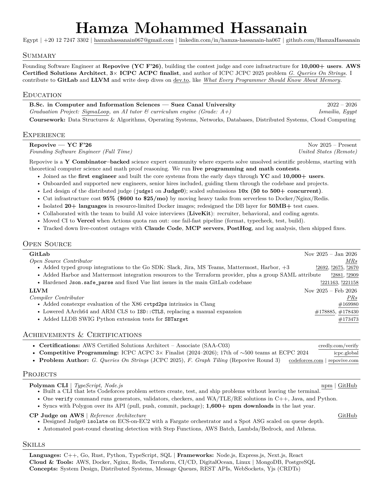

# Hamza Mohammed Hassanain — CV

Software Engineer · AWS Certified Solutions Architect – Associate · 3× ACPC Finalist.

**[📄 Download the PDF](./Hamza_Mohammed_Hassanain_CV.pdf)** &nbsp;·&nbsp; preview below (GitHub's inline PDF viewer is occasionally flaky — the image and the download link always work).



## Build

One command builds the source and updates the committed PDF, enforcing the 1-page rule:

```bash
sh ./build.sh            # -> Hamza_Mohammed_Hassanain_CV.pdf  (fails if not exactly 1 page)
```

`build.sh` uses `tectonic` if it's on your `PATH`, otherwise it bootstraps a local copy into
`./.tools/` (git-ignored). `pdflatex` is used as a fallback if present.

### Auto-build before every commit

A pre-commit hook rebuilds the PDF and stages it whenever you change any `.tex`/`.sty`, so the
committed PDF is never stale. Enable it once per clone:

```bash
git config core.hooksPath .githooks
```

If the CV ever compiles to more than one page, the hook aborts the commit.

### CI

[`.github/workflows/build-cv.yml`](.github/workflows/build-cv.yml) builds the CV on every push,
fails the run if it is not exactly one page, and uploads the PDF as a downloadable artifact.

## Layout

```
resume.tex          main file — header (name + contact line), section order
cvstyle.sty         styling (Jake's Resume layout: headings, bullets, spacing)
sections/           one file per section
  summary.tex       three-line summary (Repovive, AWS, ACPC, open source, dev.to)
  education.tex     degree, SigmaLoop graduation project, coursework
  experience.tex    Repovive — Founding Software Engineer
  open-source.tex   GitLab and LLVM, grouped by project, MR/PR links on the right
  achievements.tex  AWS certification, ICPC ACPC, problem authoring
  projects.tex      Polyman CLI, CP Judge AWS reference architecture
  skills.tex        languages, frameworks, cloud & tools, concepts
```

## House rules (keep these when editing)

These constraints keep the CV tight and credible — preserve them in any future edit:

1. **One page.** Everything must fit on a single letter page. Verify page count after every change.
2. **Small but readable fonts.** Base is `10pt` (Computer Modern). Maximise information density, but never below readable size.
3. **No wasted horizontal space.** Write each line to run close to the full text width — no short, half-empty lines.
4. **Each bullet is at most one line.** If a bullet wraps, shorten it (drop a link or a few words), don't let it spill.
5. **Match the reference layout.** Follow Jake's Resume style: small-caps section rules, bold heading with dates on the right, links on the right of each bullet.
6. **Every claim must survive a click.** Describe merged PRs/MRs by what the diff actually does; link them. No inflated framing.

## License

See [`LICENSE.txt`](./LICENSE.txt). Résumé content © Hamza Mohammed Hassanain; layout based on Jake's Resume (Jake Gutierrez, MIT).
